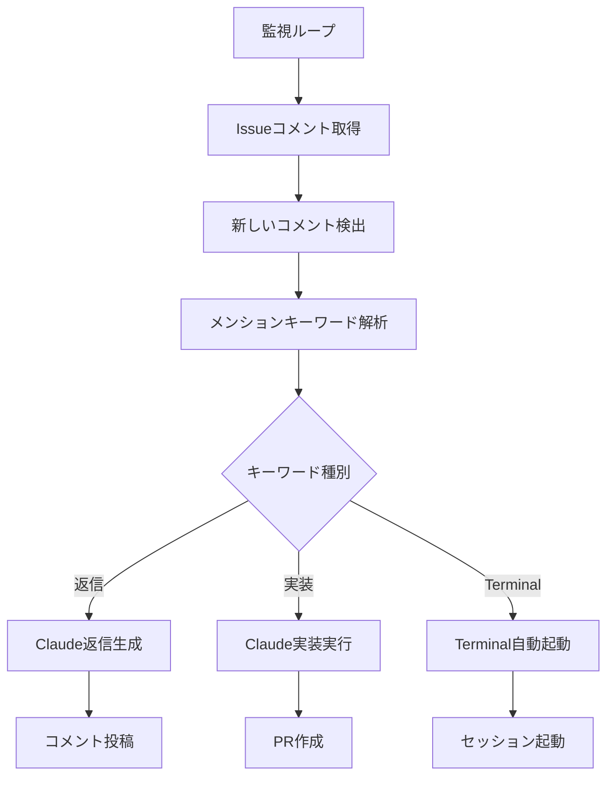

# コメントメンション機能

Claude Automation Systemでは、GitHubのIssueコメント内でメンションを使用してClaudeを呼び出すことができます。

## 概要

コメントメンション機能により、Issue本文だけでなく、Issue内のコメントでも自動的にClaudeを呼び出せます。これにより、議論の流れの中で動的にClaudeからの回答や実装を要求できます。

## 対応キーワード

### 返信モード（コメントへの返信）
- `@claude-explain` - 詳細な説明や解説を要求
- `@claude-reply` - 一般的な返信を要求
- `@claude-discuss` - 議論や分析を要求
- `@claude-analysis` - 技術的な分析を要求

### 実装モード（コード実装）
- `@claude-implement` - 機能の実装を要求
- `@claude-create` - 新しいファイルやコンポーネントの作成
- `@claude-fix` - バグ修正や問題解決

### Terminal自動起動モード
- `@claude-terminal` - Terminal自動起動でインタラクティブセッション
- `@claude-interactive` - 対話的な作業セッション

## 使用方法

### 1. 基本的な使用方法

Issue内のコメントで以下のようにメンションします：

```
@claude-explain 
分子動力学法で使用される具体的なアルゴリズム（Verlet法など）について説明してください。
```

### 2. 実装要求

```
@claude-implement
このバグを修正してください：

- エラー内容: 配列のインデックス範囲外
- 発生箇所: src/utils/array-helper.js:42行目
- 期待動作: 範囲外アクセスの際は空の値を返す
```

### 3. Terminal自動起動要求

```
@claude-terminal
複雑なリファクタリング作業が必要です。
APIの構造を全面的に見直して、新しい設計で実装し直してください。
```

## 機能の特徴

### 🎯 コンテキスト認識
- **Issue本文とコメントの関連性**: システムはIssue全体の文脈を理解した上でコメントに返信
- **投稿者への直接返信**: コメント投稿者に向けた個別返信として生成
- **過去の議論履歴**: Issue内の過去のやり取りも考慮

### ⚡ リアルタイム処理
- **即座の検出**: コメント投稿後約60秒以内で自動検出
- **非同期処理**: 他のIssue処理と並行してコメント処理を実行
- **重複回避**: 同じコメントの重複処理を防止

### 🔄 実行履歴の独立性
- **別実行として扱い**: Issue本文の処理状況に関係なくコメントを処理
- **複数回実行可能**: 同じIssueで何度でもコメントメンション可能
- **履歴管理**: コメントトリガーの実行履歴も適切に管理

## 動作例

### 返信モードの例

**コメント:**
```
@claude-explain 
React HooksのuseEffectの依存配列について詳しく説明してください。
```

**Claudeの返信:**
```
@nori-ut3g さん、useEffectの依存配列について説明いたします。

## useEffectの依存配列

依存配列は、useEffectの第二引数として渡す配列で、エフェクトの実行タイミングを制御します。

### 基本的な動作

1. **依存配列なし**: 毎回実行
2. **空の依存配列[]**: 初回のみ実行  
3. **値を含む依存配列**: 依存値が変更された時のみ実行

### 実例

\`\`\`javascript
// 毎回実行（非推奨）
useEffect(() => {
  console.log('毎回実行される');
});

// 初回のみ実行
useEffect(() => {
  console.log('マウント時のみ実行');
}, []);

// stateが変更された時のみ実行
useEffect(() => {
  console.log('countが変更された');
}, [count]);
\`\`\`

---
🤖 この返信は [Claude Automation System](https://github.com/anthropics/claude-code) によって自動生成されました。
```

### 実装モードの例

**コメント:**
```
@claude-implement
入力値検証用のユーティリティ関数を作成してください。
- 文字列長チェック
- メールアドレス形式チェック  
- 数値範囲チェック
```

**結果:**
- validator.jsファイルの自動作成
- 指定された3つの検証関数を実装
- Pull Requestの自動作成
- Issue内に完了報告コメントを投稿

## 設定

### リポジトリ設定

`config/repositories.yaml`でコメントメンション機能を有効化：

```yaml
repositories:
  - name: "your-org/your-repo"
    enabled: true
    reply_keywords:
      - "@claude-explain"
      - "@claude-reply"
      - "@claude-discuss" 
      - "@claude-analysis"
    implementation_keywords:
      - "@claude-implement"
      - "@claude-create"
      - "@claude-fix"
    terminal_keywords:
      - "@claude-terminal"
      - "@claude-interactive"
```

### コメント追跡設定

システムは`comment_tracker.json`でコメントの最終チェック時刻を管理：

```json
{
  "repositories": {
    "your-org/your-repo": {
      "last_check": "2025-06-01T00:39:25Z"
    }
  }
}
```

## 技術詳細

### アーキテクチャ

1. **monitor.sh**: 定期的にIssueコメントをチェック
2. **event-processor.sh**: コメントトリガーイベントを処理
3. **claude-reply.sh**: コメント専用の返信処理
4. **comment_tracker.json**: コメントチェック履歴の管理

### 処理フロー



### API使用量最適化

- **GitHub API**: 効率的なコメント取得でAPI制限を回避
- **差分チェック**: 最終チェック時刻以降のコメントのみ処理
- **バッチ処理**: 複数コメントを効率的に一括処理

## トラブルシューティング

### よくある問題

**Q: コメントが検出されない**
A: 以下を確認してください：
- リポジトリ設定でコメントキーワードが含まれているか
- Issue に`claude-auto`ラベルが付いているか
- システムが正常に動作しているか（`./scripts/health-check.sh`）

**Q: 返信が生成されない**
A: 以下をチェック：
- Claude Code CLIが正しく認証されているか
- 実行履歴で処理が完了しているか（`execution_history.json`）
- ログファイルでエラーが発生していないか

**Q: 重複した返信が投稿される**
A: 
- `comment_tracker.json`の最終チェック時刻を確認
- 同じコメントが複数回処理されていないかログで確認

### ログの確認

```bash
# 全体ログ
tail -f logs/claude-automation.log

# コメント関連のログのみ
grep -i comment logs/claude-automation.log

# 特定Issueの処理ログ
grep "Issue #18" logs/claude-automation.log
```

### 手動テスト

コメントメンション機能を手動でテストする方法：

```bash
# 特定Issueのコメントをチェック
./src/core/monitor.sh check_once your-org/your-repo

# claude-reply.shを直接テスト
echo '{"event_type":"reply","repository":"your-org/your-repo","issue_number":123,"issue_title":"Test","issue_body":"test","found_keyword":"@claude-explain","trigger_comment":{"body":"@claude-explain テストです","author":"username"}}' | ./src/core/claude-reply.sh
```

## 制限事項

- GitHub API Rate Limit: 1時間あたり5000リクエスト
- Claude Code実行時間: 最大10分/実行
- 同時実行数: 最大3プロセス
- コメント検出遅延: 最大60秒（監視間隔による）

## セキュリティ

- **権限制御**: GitHub Private Access Tokenによるアクセス制御
- **ワークスペース分離**: 各実行は独立したワークスペースで実行
- **クリーンアップ**: 実行後の一時ファイル自動削除
- **ログ管理**: 機密情報のログ記録回避

## 関連ドキュメント

- [メインREADME](../README.md)
- [設定ガイド](CONFIGURATION.md)
- [API連携](INTEGRATIONS.md)
- [トラブルシューティング](TROUBLESHOOTING.md)